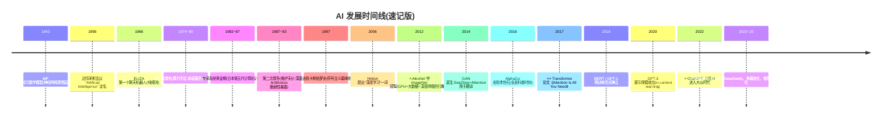

# 第一章 · 人工智能概述

> 本章地图:先给"智能"和"人工智能"下定义 → 认识三大学派百年之争 → 走一遍七十年兴衰史(两次寒冬与三次浪潮) → 厘清 AI/ML/DL/LLM 的包含关系 → 最后认识驱动一切的"三要素"。
> 🔗 系列:[[00-课程总览]] | 下一章:[[02-深度学习]]

## 1.1 什么是"人工智能"

**定义(工作版)**:让人造系统表现出**通常需要人类智能才能完成的任务**的能力——识别、理解、推理、学习、决策、创造。

💡 这个定义刻意模糊,因为"需要人类智能吗"这件事在不断贬值:1997 年深蓝赢国际象棋之前,"下棋"被普遍认为是智能的标志;如今没人觉得计算器聪明。这叫 **AI 效应**——AI 就是"还没做成的东西"。做成了,它就成了"程序"。

### 图灵测试与它的现代版

1950 年图灵提出模仿游戏:人隔着幕布与机器和真人打字聊天,如果分不出谁是机器,**在行为层面上**就可以说它有智能。

⚠️ **现代困境**:ChatGPT 类模型轻松通过传统图灵测试,但没人认为它们拥有人类式心智。于是学界有了更细致的判断维度:

| 维度 | 问题 | 大模型现状 |
|---|---|---|
| 行为层面 | 看起来聪明吗? | ✅ 已通过 |
| 能力泛化 | 新任务能自学吗? | 部分具备(in-context learning) |
| 因果理解 | 懂"为什么"还是只会相关性? | 弱(主要学统计相关) |
| 具身常识 | 能把知识用于物理世界吗? | 很弱(见[[06-多模态大模型与具身智能]]) |
| 自主意识 | 有主观体验吗? | 无证据,科学上也无法测量 |

⭐ 面试/谈资要点:**图灵测试测的是行为模仿能力,不是意识**。图灵本人很清楚这点——他故意绕开了"机器能不能思考"这个无法回答的问题。

### 三层金字塔:ANI / AGI / ASI

```
ASI 超级人工智能 —— 全面碾压最聪明的人类 (科幻边界)
AGI 通用人工智能 —— 人能干的脑力活它都能干 (业界竞逐目标)
ANI 专用人工智能 —— 单一任务超人,跨任务无能 (今天的全部现实)
```

今天所有产品——ChatGPT、Claude、自动驾驶、AlphaFold——严格说都是 ANI。但注意:**LLM 是第一个"通用性看得到 AGI 影子"的 ANI**,这正是 2020 年代全球疯狂的原因。AGI 何时到来?从"永远不会"到"还有两三年"都有严肃辩护者,诚实回答是:没人知道,且预测记录很差。

## 1.2 三大学派:一场持续 70 年的方法论战争

| 学派 | 核心信条 | 实现方式 | 代表成就 | 💡类比 |
|---|---|---|---|---|
| **符号主义**(Logicism) | 智能 = 符号运算与逻辑推理 | 规则库、专家系统、知识图谱、定理证明 | 专家系统 MYCIN、Deep Blue、Siri 早期架构 | 法学家:一切按条文推理 |
| **连接主义**(Connectionism) | 智能 = 从大量神经元连接中涌现 | 神经网络、深度学习(本课程主线) | AlexNet、Transformer、GPT 全家 | 婴儿:没人教语法,听多了自然会 |
| **行为主义**(Actionism) | 智能 = 与环境交互中习得 | 强化学习、控制论、机器人进化算法 | AlphaGo(结合连接主义)、波士顿动力 | 训兽师:奖励对了,行为就有了 |

⭐ **历史主线是连接主义的胜利**,但别真的以为符号主义死了:
- AlphaGo = 连接主义(神经网络估值/走子)+ 符号方法(蒙特卡洛树搜索);
- OpenAI o1 / DeepSeek R1 的推理链、OpenClaw 类 Agent 的工具编排,本质都是在神经网络外挂"显式步骤规划"(某种意义的行为主义+符号回魂);
- 前沿方向 Neuro-Symbolic AI(神经符号结合)试图正式合流(详见 [[07-人工智能与认知计算]])。

## 1.3 七十年简史:两次寒冬,三次浪潮



**两次寒冬的共同教训**(面试可讲):宣传承诺远超技术成熟度 → 投资退潮。第一寒冬死于算力与数据都太小;第二寒冬死于专家系统的脆弱与维护成本。**判断一个 AI 方向能否活下来,永远看三个东西:数据够不够、算力够不够、方法论有没有普适性。**

**为什么 2012 年是分水岭?** 不是发明了新理论,而是三件事第一次同时到位:

| 要素 | 2012 年的状态 |
|---|---|
| 数据 | ImageNet 1400 万标注图片(李飞飞团队,2009 起积累) |
| 算力 | GPU 可编程(CUDA),并行矩阵计算快 CPU 数十倍 |
| 方法 | 深层 CNN + ReLU + Dropout 等训练技巧成熟 |

⚠️ 这个"三要素同时到位"的分析框架,之后每章都会用到——包括理解当前 LLM 行业的产能瓶颈(见 1.5)。

## 1.4 概念层级:AI ⊃ ML ⊃ DL ⊃ GenAI ⊃ LLM

```
┌─────────────────────────────────────────────┐
│ 人工智能 AI:让机器表现智能的一切尝试            │
│   含规则系统/搜索/规划/概率推理/机器人……        │
│  ┌───────────────────────────────────────┐  │
│  │ 机器学习 ML:不写死规则,从数据中学规律    │  │
│  │  含线性回归/SVM/随机森林/聚类……          │  │
│  │  ┌─────────────────────────────────┐  │  │
│  │  │ 深度学习 DL:多层神经网络自动       │  │  │
│  │  │ 学习特征表示                      │  │  │
│  │  │   ┌─────────────────────────┐   │  │  │
│  │  │   │ 生成式 AI GenAI          │   │  │  │
│  │  │   │ 学习分布并创造新内容      │   │  │  │
│  │  │   │   ┌────────────────┐    │   │  │  │
│  │  │   │   │ 大语言模型 LLM  │    │   │  │  │
│  │  │   │   └────────────────┘    │   │  │  │
│  │  │   └─────────────────────────┘   │  │  │
│  │  └─────────────────────────────────┘  │  │
│  └───────────────────────────────────────┘  │
└─────────────────────────────────────────────┘
```

⭐ 每层的分界判据(考试/面试高频):

| 概念 | 分界特征 |
|---|---|
| ML vs 非 ML(AI) | 参数是从**数据中学的**,还是人写死的?(决策树是 ML;贪心寻路不是) |
| DL vs 传统 ML | 特征是**网络自己学的**,还是人工设计的?(手搓 SIFT 特征是传统;CNN 自动提特征是 DL) |
| GenAI vs 判别式 | 输出的是**新内容样本**(文本/图像),还是**类别/数值标签**?(分类器判别;文生图生成) |
| LLM vs 其他 GenAI | 主干是不是**语言模态的自回归 Transformer**?(Stable Diffusion 是 GenAI 非 LLM;GPT/Claude/Qwen 都是 LLM) |

## 1.5 驱动一切的三要素(以及第四要素)

| 要素 | 角色 | 度量 | 当前瓶颈形态 |
|---|---|---|---|
| **数据** | 教材 | token 数、质量 | 高质量公开文本接近"见底",转向合成数据/多模态/私域数据 |
| **算法** | 方法论 | 收敛速度、样本效率 | 架构微创新(MoE/长上下文/注意力优化)+训练配方(RLVR) |
| **算力** | 生产资料 | FLOPs、HBM 带宽、互联 | 高端 GPU 供应与集群互联成本,万卡联训工程难度 |

💡 **类比工厂**:数据=原材料,算法=工艺,算力=机器。任一短缺,产品出不来;三者都在涨,才有"摩尔定律式的体验进步"。第四要素常被忽略——**工程师人才与工程组织能力**,万卡集群一次训练失败烧掉数百万美元,容错与调试能力本身就是竞争力。

## 1.6 AI 能做什么、不能做什么(2026 版清醒剂)

**已比较成熟**:文本理解与写作、代码(辅助乃至独立完成中型任务)、图像视频生成(真假难辨)、特定领域问答超越平均人类水平、多语言翻译、信息检索整合(Agent 深度调研)。

**仍不可靠或做不到**:
- **可靠的事实保证**——会一本正经编造(幻觉,机制见[[04-大语言模型]]);
- **严格的数学证明与全新原创理论**——推理模型大幅进步但仍非万能;
- **长程自主执行而不跑偏**——几十步以上的复杂操作需要监控;
- **物理世界的灵巧操作**——叠衣服难于下围棋(Moravec 悖论,详见[[06-多模态大模型与具身智能]]);
- **真正的因果推理与反事实思考**——"如果当初没下雨会怎样"这类问题经常露怯;
- **知道自己不知道**(校准度有限)——过度自信与过度谦逊并存。

## 1.7 本章小词典(黑话扫盲)

| 词 | 一句话解释 |
|---|---|
| 泛化 Generalization | 在没见过的数据上依然好使——ML 的终极目标 |
| 过拟合 Overfitting | 把训练题背下来了,换新题就不会 |
| 归纳偏置 Inductive Bias | 模型结构自带的学习倾向(如卷积假设"近处像素相关") |
| 端到端 End-to-End | 中间环节全部交给神经网络,不做手工模块切分 |
| 基准 Benchmark | 标准化考卷(MMLU、ImageNet…) |
| SOTA | State of the Art,当前最好成绩 |
| 对齐 Alignment | 让模型行为符合人类意图与价值观(第十章核心话题) |
| 缩放定律 Scaling Laws | 性能随数据/参数/算力幂律提升的实证规律(第四章详述) |

## ❓自测八问

1. 图灵测试测什么、不测什么?"AI 效应"是什么?
2. ANI/AGI/ASI 怎么区分?今天的 ChatGPT 属于哪层?为什么说它是"特殊的 ANI"?
3. 三大学派的信条各一句话,各自的代表成果是什么?
4. 两次 AI 寒冬各自的技术原因?
5. 为什么偏偏是 2012 年爆发而不是更早?(答出三要素对应物)
6. 用"学不学参数"判据:贪心最短路算法属于 ML 吗?决策树呢?
7. LLM 和 Stable Diffusion 在概念层级里怎么摆?
8. 四个贯穿母题是什么?各自对应的追问句式?

## 🧭 下一站

概念铺垫完毕。接下来进入全书地基:[[02-深度学习]]——神经网络到底是怎么"学"的。
