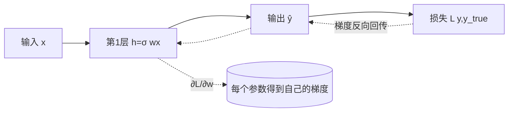

# 第二章 · 深度学习

> 本章地图:一个神经元怎么工作 → 网络怎么堆起来 → 学习的数学本质(损失+梯度+反向传播) → 优化器与调参常识 → 训练炼丹的常见病(过拟合)和药方(正则化) → CNN/RNN 两种经典结构及局限 → 最后点出注意力机制为什么必然登场。
> 🔗 系列:[[00-课程总览]] | 上一章:[[01-人工智能概述]] | 下一章:[[03-自然语言处理]]
> ⭐ 本章是全书地基,**看不懂反向传播没关系**,但每个类比都要留下印象;后面第四章讲 Transformer 时会全部串起来。

## 2.1 神经元:一台"加权投票机"

生物神经元:树突收信号 → 胞体汇总 → 超过阈值就沿轴突放电。1943 年 McCulloch 与 Pitts 把它抽象成数学:

```
输出 = f( w1·x1 + w2·x2 + ... + b )

x = 输入     w = 权重(重要性)     b = 偏置(启动门槛)
f = 激活函数(决定是否/多大程度"点火")
```

💡 **类比:班级评奖学金**
- x1=成绩, x2=综合测评, x3=出勤
- w 是各指标的权重(成绩 0.7、综测 0.2、出勤 0.1——权重就是"学习到的东西")
- b 是基本门槛;"加权总分 ≥ 阈值才通过"

⭐ **学习的本质(全书最重要的一句话):训练 = 不停地微调 w 和 b,直到模型的输出与正确答案的差距最小。** 神经网络没有任何魔法,就是把几亿个这种投票机的权重一起调好。

## 2.2 感知机的死穴与多层网络的翻盘

单层感知机只能画一条直线切分数据。1969 年 Minsky 证明:**异或(XOR)问题它学不会**——四个点你无法用一条直线把"输出 1 的两个点"圈在一边。

解法:**加一层隐藏层**(多层感知机 MLP)。两层网络可以把平面折叠再折叠,任意弯出边界。

> **万能近似定理**:足够宽的单隐层网络原则上能逼近任意连续函数。"原则上"三个字很关键——能表示≠能学到(第二寒冬的教训之一:没有高效训练算法时,网络只是纸上谈兵)。

```python
# 一个最小 MLP(PyTorch)
import torch.nn as nn
model = nn.Sequential(
    nn.Linear(784, 256),   # 输入层→隐藏层(一张展平的手写数字图 28×28)
    nn.ReLU(),             # 非线性激活
    nn.Linear(256, 10),    # 隐藏层→输出层(0~9 十类)
)
# 235,306 个可学习参数——全是等着被调的 w 和 b
```

## 2.3 激活函数:给网络注入"非线性"

没有激活函数,一百层线性变换叠起来仍是一个线性变换(矩阵乘法结合律),深度毫无意义。**激活函数是非线性的火种。**

| 函数 | 公式形状 | 优点 | 缺陷 | 用在哪 |
|---|---|---|---|---|
| Sigmoid | S 形压到 (0,1) | 可解释为概率 | 两端梯度≈0(饱和);输出非零中心 | 二分类输出端 |
| Tanh | S 形 (-1,1) | 零中心 | 同样会饱和 | 老 RNN |
| **ReLU** | max(0,x) | 计算飞快;正区不饱和 | "神经元死亡"(一直输出 0) | CNN 默认 |
| **GELU/SwiGLU** | 平滑版 ReLU | 梯度性质好 | 略贵 | **Transformer 默认**(LLM 都在用) |

💡 直觉:ReLU 像"只报忧不报喜的门卫",负数一律不放行。简单粗暴却有效——2000 年代它的普及直接缓解了深层网络的梯度消失(见 2.6)。

## 2.4 损失函数:给"错"定价

模型输出 vs 正确答案之间差多少?需要一个标量打分器:

| 任务 | 损失 | 公式直觉 |
|---|---|---|
| 回归(预测房价) | MSE 均方误差 | 差的平方取平均;大错罚得狠(平方惩罚) |
| 分类(猫狗十类) | **交叉熵 Cross Entropy** | 给正确类别预测的概率越低,罚越重 |

⭐ 分类输出的标准姿势:logits(原始得分) → **softmax**(变成总和为 1 的概率):

$$P(y_i) = \frac{e^{z_i}}{\sum_j e^{z_j}}$$

⚠️ 为什么配对的是 softmax+CE 而不是 sigmoid+MSE?
1. CE 的梯度形式漂亮:**误差越大梯度越大**,学得快;
2. softmax+CE 数学上等价于"最大化对数似然",统计上站得住;
3. 配合数值技巧(log-sum-exp)可避免上溢下溢。
面试一句话:**这是收敛性和概率解释双赢的历史选择。**

💡 LLM 预训练损失就是这个分类交叉熵:词表 15 万个词,"下一个词是什么"是一道 15 万选 1 的选择题。这句话请务必记住,第四章见。

## 2.5 梯度下降:蒙眼下山

问题:百万维参数空间里,往哪边调参数能让损失变小?

**方法**:计算损失对每个参数的**偏导数**(梯度=所有偏导组成的向量),反着梯度方向走一小步:

$$\theta_{new} = \theta_{old} - \eta \cdot \nabla L(\theta)$$

💡 **经典类比:蒙眼下山**。你看不见整座山(不知道全局最优),但脚底能感觉到坡度(局部梯度),于是沿最陡的下坡方向挪一步,再感受,再挪。η(学习率)=步幅:
- 步子太大 → 跨过头,来回震荡甚至越走越高(发散);
- 步子太小 → 天荒地老走不到底(训练太慢);
- 山谷是弯的 → 沿谷壁来回弹(Gap:后面用动量解决)。

### 三种batch口径

| 名称 | 每步用多少样本 | 特点 |
|---|---|---|
| BGD 批量 | 全部数据 | 方向稳,慢到没法用于大数据 |
| SGD 随机 | 1 个样本 | 快而抖动 |
| **Mini-batch** | 一小撮(32~4096) | 工业标准;"SGD"口语里常指它 |

### 优化器进化史(必考)

| 优化器 | 思想 | 💡类比 |
|---|---|---|
| SGD | 走梯度反方向 | 蒙眼下坡 |
| Momentum | 累积历史方向,惯性前进 | 铅球滚下山,谷壁震荡被惯性抹平 |
| Adam | 动量 + 自适应步长(按各维度梯度大小分别缩放) | 每个参数有自己的快慢挡位 |
| **AdamW** | Adam + 解耦权重衰减 | 除自适应外,定期"轻推"参数归零防膨胀——**今天大模型训练的事实标准** |

### 学习率策略(LR Schedule)

- **Warmup**:前几百步故意用极小步长(刚开局梯度很野,先热身);
- **余弦退火 Cosine**:像太阳落山一样平滑减速到接近零;
- **LR 与 batch size 同缩放**:批大了步长也可加大。大模型训练超参里,学习率是最敏感的一个,没之一。

## 2.6 反向传播:自动算梯度的链式法则

要更新百万个参数,就得知道损失对**每一个**参数的导数。逐个数值试探太蠢(次数=参数量),反传的思想一次搞定:

**损失 L = f(g(h(w))) 这样的嵌套函数,则 ∂L/∂w = ∂L/∂f × ∂f/∂g × ∂g/∂h × ∂h/∂w(链式法则连乘)。**

💡 **类比:工厂追责流水线**。产品报废(损失变大),从出货口一路往回查每道工序的责任占比:总检验员→装配→零件加工。每一环把自己的"影响系数"乘上传给上一环——这就是为什么叫**反向**:正向算输出,反向传责任(梯度)。



**现代实现没人手写这个**——PyTorch/JAX 的自动微分(autograd)包办一切,`loss.backward()` 一行完事。理解思想即可,工程交给框架。

⚠️ **两大梯度病**(面试高频):
- **梯度消失**:连乘中出现大量 <1 的因子(sigmoid 导数最大才 0.25,十几层下去梯度趋零)→ 深处学不动。药方:ReLU、残差连接(ResNet)、LayerNorm。
- **梯度爆炸**:连乘 >1 因子失控 → NaN。药方:梯度裁剪(gradient clipping,超过阈值按比例压回)。

## 2.7 数据切分与"过拟合"诊疗

**标准三分法**:

```
训练集 70~80% —— 刷题
验证集 10~20% —— 模拟考(调超参/早停依据)
测试集 10~20% —— 高考(只用一次,绝不参与任何决策)
```

⚠️ 测试集泄漏是新手第一大罪:预处理(如标准化)必须用**训练集统计量**套用到其余集合;更隐蔽的泄漏如时间穿越(拿未来数据训过去模型)。LLM 时代还有第三种:**基准污染**——考试题进了预训练语料,分数虚高([[04-大语言模型]] 会再提)。

**诊断曲线**(必会读图):

| 现象 | 诊断 | 药方 |
|---|---|---|
| train 低 val 高 | 过拟合(背题) | 见下方正则化全家桶 |
| train val 都高 | 欠拟合(太菜) | 加容量/训久一点/特征更牛 |
| train 还降 val 反升 | 已过拐点 | 早停 Early Stopping |

**正则化全家桶**(防背题的物理直觉:让模型"记性变差"):

| 手段 | 做法 | 类比 |
|---|---|---|
| L2 权重衰减 | 惩罚大权重 | 别依赖任何单一笔记 |
| Dropout | 训练时随机丢一部分神经元 | 团队随机请假,逼人人多面手 |
| 数据增强 | 翻转/裁剪/加噪扩充数据 | 同一知识点换着花样出题 |
| Batch/Layer Norm | 归一化层内分布 | 统一考试难度区间 |
| 标签平滑 | 正确标签 1.0 → 0.9 | 别把话说满,留余地 |
| 减小模型/更多数据 | 根本性方案 | 脑容量小了塞不下死记硬背 |

💡 BN vs LN 一句话分家:BatchNorm 沿"批"方向归一化(吃 batch 内统计,适合 CV);**LayerNorm 沿"特征维"归一化(与 batch 无关)——文本序列长度参差不齐,所以 Transformer 用 LayerNorm**。记住这句,CV/NLP 的一个隐性差异就通了。

## 2.8 经典结构巡礼:CNN / RNN 与它们的宿命

### CNN(卷积神经网络)— 空间数据之王

核心操作卷积:一个小核(kernel,如 3×3)滑过图像做加权求和。两大先验:
1. **局部性**:相邻像素强相关(核只看局部);
2. **平移不变/参数共享**:同一核扫全图(猫在左上角还是右下角都认识)。

层次堆叠后逐级抽象:边缘 → 纹理 → 局部部件 → 整体物体。(完整故事在[[05-计算机视觉]])

### RNN(循环神经网络)— 序列的老前辈

处理文本/时序:维护一个隐状态 h,逐 token 读入并更新:hₜ = f(W·hₜ₋₁ + U·xₜ)。

致命伤:
- **顺序执行**无法并行(2026 年 GPU 世界里这几乎等于死刑);
- **长程遗忘**:h 就一个向量,50 个 token 前的信息早被冲淡(理论上有 LSTM/GRU 门控续命,实践上限依然低);
- 梯度在时间维度上连乘 → 消失/爆炸高发区。

### 宿命:两者都被 Attention 收编

Transformer 论文标题《Attention Is All You Need》的意思正是:**既不要卷积(不需要 locality 先验),也不要循环(不需要顺序传递)**,让每个 token 直接与所有 token 两两交互,一举同时解决并行化与长程依赖——这是下一章到第四章的主线剧情。

💡 卷积/RNN 没有死:CNN 仍是视觉编码器常客,RNN 思想则在 Mamba/线性注意力等新架构中借尸还魂("为了 O(n) 复杂度,部分找回递归")。

## 2.9 算力基础:为什么 AI 恋上了 GPU

神经网络训练 ≈ 海量**矩阵乘法**。GPU 有几千个小核心并行干同一件事(CPU 十几个全能 core 擅长复杂逻辑,不适合)。2012 AlexNet 用两块 GTX580 点燃革命,此后 NVIDIA 靠 CUDA 生态建立帝国。几个关键概念:

| 术语 | 含义 |
|---|---|
| FLOPs | 浮点运算次数;模型所需算力的度量 |
| HBM | 高带宽显存——大模型推理的真正瓶颈常常是显存带宽而非算力 |
| 显存占用 | 参数 + 梯度 + 优化器状态 + 激活值(训练≈参数量的 16 倍 FP16 字节,详见推理章) |
| 混合精度 | FP16/BF16 计算 + FP32 主权重的折中,又快又稳 |

🧪 **动手(Mac 上就能跑)**:装 PyTorch 后跑通 2.2 的最小 MLP 在 MNIST 上 95%+ 只需 30 行代码与几分钟——这一小时投入回报极高。

## ❓自测十问

1. 学习的本质用一句话怎么说?(w/b 目标)
2. 为什么必须有激活函数?XOR 说明了什么?
3. softmax+交叉熵为什么是天生一对?(至少两条理由)
4. 蒙眼下山对应什么?学习率太大/太小分别什么下场?
5. AdamW 比原生 Adam 多了什么?"解耦"指什么?
6. 反向传播用的数学工具叫什么?"反向"体现在哪?
7. 梯度消失的两个成因与三种药方?
8. 读图:train loss 0.02,val loss 0.35,诊断与三副药?
9. BN 和 LN 的区别一句话?为什么 Transformer 选 LN?
10. RNN 三宗罪是什么?Transformer 分别用什么手段解决的?

## 🧭 下一站

地基打好。接下来回到文字的世界:[[03-自然语言处理]]——机器是怎么一步步学会"读懂人话"的。
